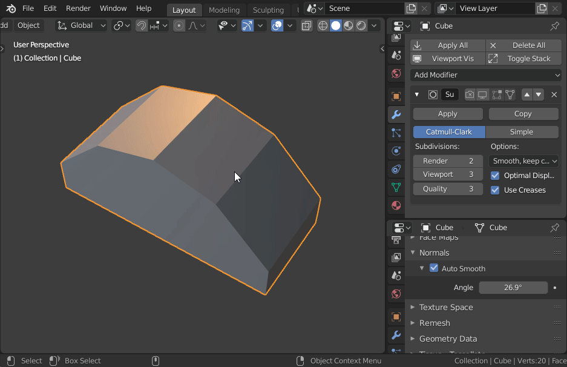
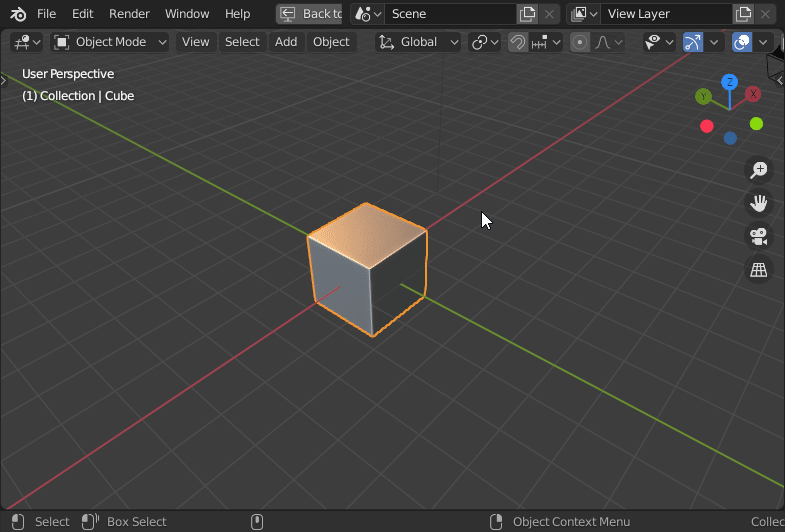
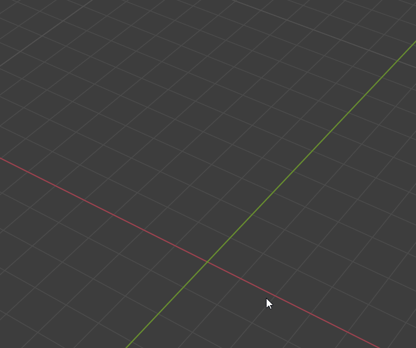

# Auto sharpen

Automatically set edges sharp (or crease them) based on the auto smooth angle setting.
Also allows making all sharp edges creases, and vice versa.

# Lock view rotation

When toggled on, prevent rotating the current 3D viewport.

# Tetrahelix

Creates a tetrahelix mesh.

